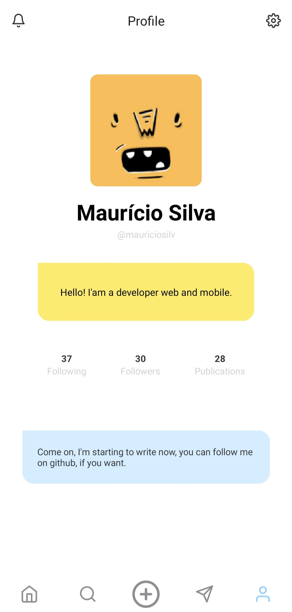

<h1 align="center">Profiles Dev</h1>
Application created as an example for a post I made using styled-components.

## Screenshot :iphone:

## Technology
- **React Native** - A lib that provides a way to create native apps for Android and iOS.
<a href="https://facebook.github.io/react-native/"><strong>about</strong></a> 
- **Styled components** - Visual primitives for the component age.
<a href="https://styled-components.com/"><strong>about</strong></a>
## Getting started
- Clone this repo using `git@github.com:MauricioSilv/profile-for-users.git`
- Enter directory: `cd profile-for-users` 
- Run `yarn` to install dependencies 

## Run app
- Run `react-native run-android` if you use it on the android simulator;
- If you use simulator IOS, run `react-native run-ios`;

:warning:  First of all, start the simulator in the case of android.
